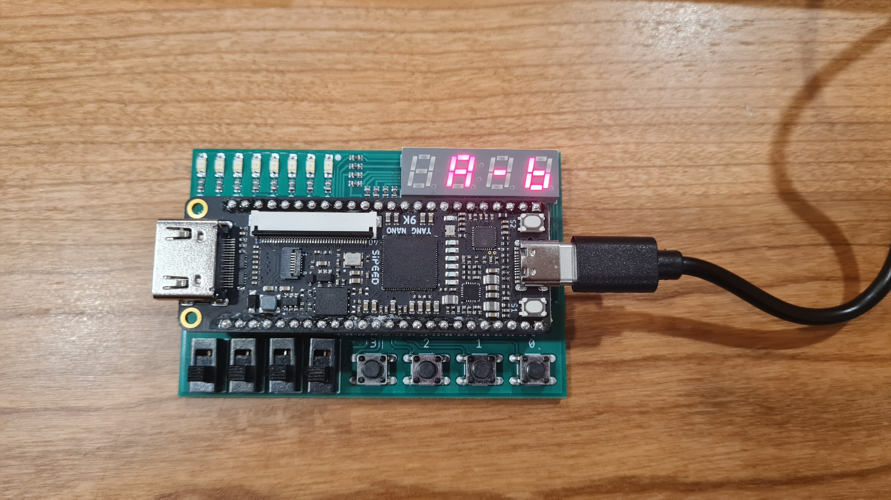

# Verilog FPGA Codebreaking Game (Tang Nano 9K)

## Overview

This project is a **Mastermind-style codebreaking game** implemented in **Verilog HDL** and deployed on a **Tang Nano 9K FPGA board**.

The design was developed as part of a **Digital Design** course and uses a **university-produced daughter board** that provides switches, LEDs, and seven-segment displays. The main focus of the project is **finite state machine (FSM) design**, synchronous digital logic, and real hardware integration.

---

## Hardware Platform

* **FPGA Board:** Tang Nano 9K (Gowin GW1NR-9)
* **Expansion:** University-provided daughter board
* **Inputs:** Push buttons / switches
* **Outputs:** LEDs and seven-segment displays
* **Constraints:** Pin mappings defined via a provided `.cst` file

---

## Hardware Demonstration



The image above shows the project running on **real FPGA hardware**, with LEDs and seven-segment displays active.

---

## Repository Structure

```
.
├── src
│   ├── student
│   │   ├── mastermind.v      # Game logic and FSM
│   │   └── top_module.v      # Top-level integration
│   ├── provided
│   │   ├── clk_divider.v     # Clock divider
│   │   ├── debouncer.v       # Button debouncing
│   │   ├── rng_module.v      # Random number generator
│   │   └── ssd.v             # Seven-segment display driver
│   └── docs
│       └── hardware_demo.jpg # Hardware photo
├── constraints
│   └── tangnano9k.cst        # FPGA pin constraints
├── README.md
└── NOTICE.md
```

---

## Design Summary

* The overall game flow is controlled by a **finite state machine** implemented in `mastermind.v`.
* User inputs are handled through debounced buttons to ensure stable operation on real hardware.
* The `top_module.v` integrates all submodules and maps FPGA I/O signals to the daughter board peripherals.
* Visual feedback is provided via LEDs and seven-segment displays.

---

## Academic Context & Attribution

This project was developed as part of a university **Digital Design** course.

The following components were **provided by the course infrastructure** and are included unchanged:

* Clock divider
* Button debouncer
* Random number generator
* Seven-segment display driver
* FPGA constraint (`.cst`) file
* Tang Nano 9K FPGA board and university-produced daughter board

All **game logic**, **FSM design**, and **top-level system integration** were designed and implemented by me.

---

## Evaluation

The project was successfully demonstrated on real hardware during the course evaluation and received **full marks**.

---

## What I Learned

* Designing and debugging FSM-based systems on FPGA hardware
* Handling asynchronous mechanical inputs safely using debouncing
* Integrating multiple Verilog modules into a synchronous design
* Working with FPGA pin constraints and board-level I/O
